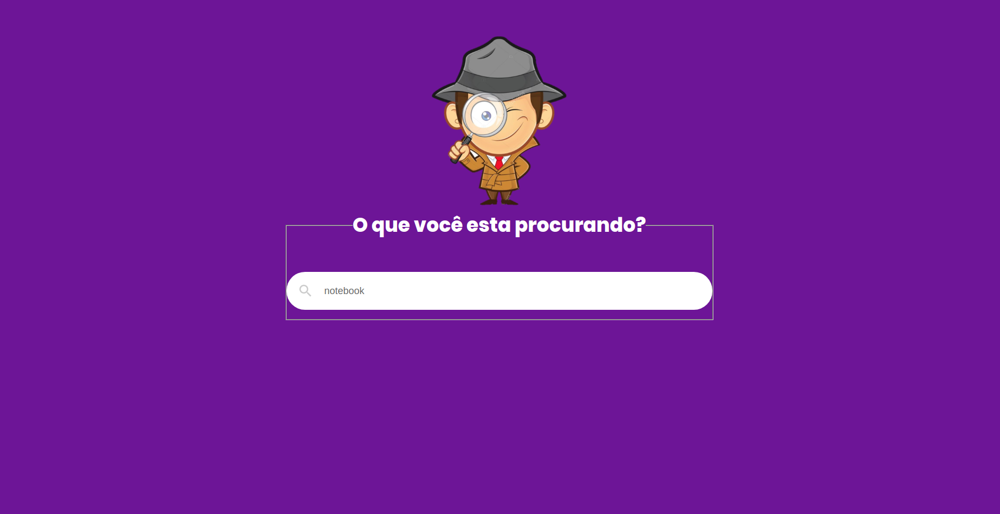
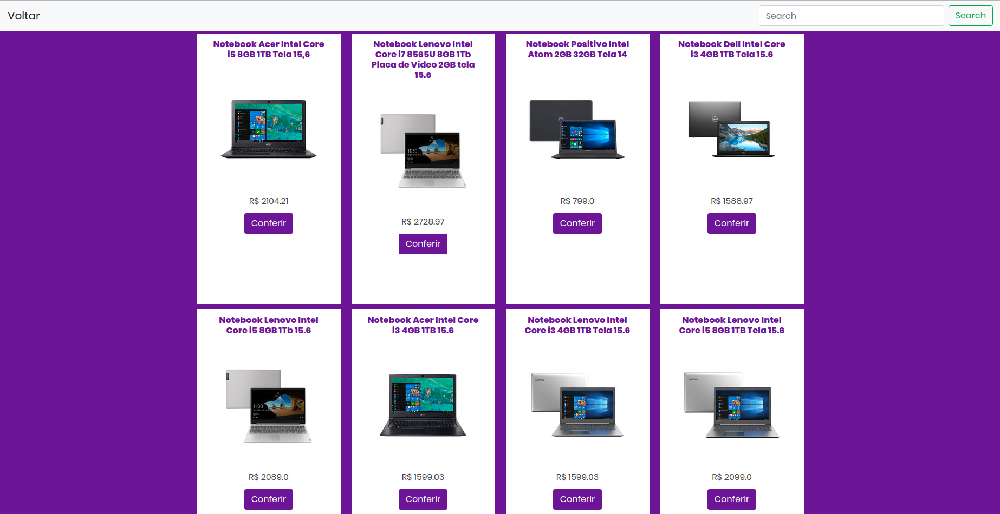
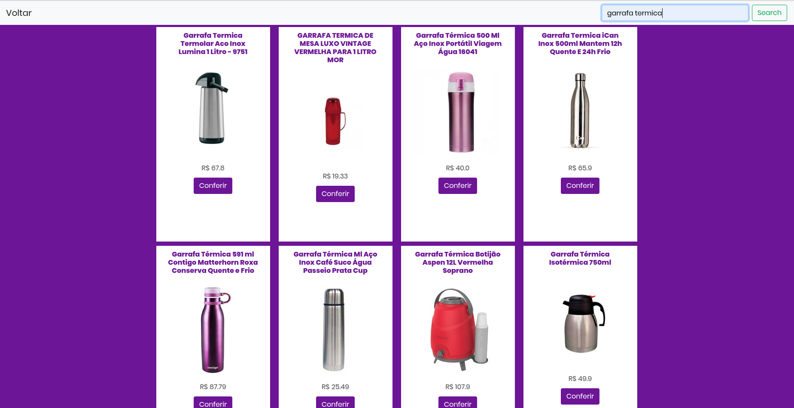

##Instalação
```shell script
git clone https://github.com/AdrianoPereira/sherlockcups.git
```

```shell script
cd sherlockcups
```

```shell script
pip install -r requirements.txt
```

```shell script
cd backend
```

```shell script
python manage.py runserver
```

## Tela inicial


## Lista de produtos


## Pesquisando de novo
